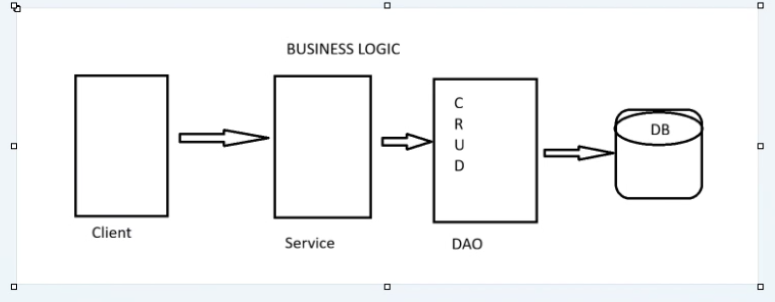

=======================================================================================================
-----------------------------------------DAY 6---------------------------------------------------------
=======================================================================================================

------------------------------------------------------------------------------------------------------

Client ----------> Service ------------> DAO(CRUD) ----------------------> DB

1. DAO -> Data Access Object
2. CURD -> Create, Update, Read, Delete
3. DB -> DataBase